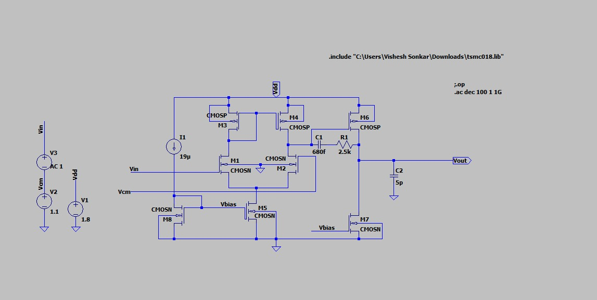
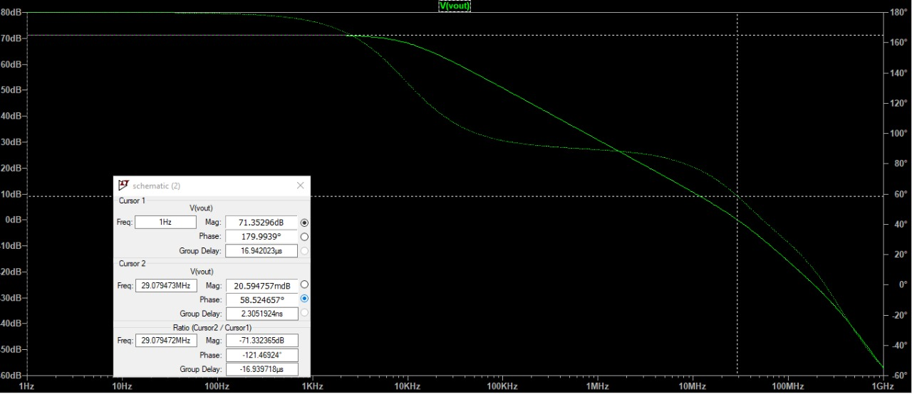

# CMOS Two-Stage Operational Amplifier Design

This repository contains the LTSpice implementation of a **two-stage Miller-compensated CMOS operational amplifier** designed to meet the specifications provided in the Continuum '25 PS-1 problem statement.

## 📌 Objective

Design and simulate a two-stage CMOS op-amp with the following specifications:

- ✅ **DC Gain**: 70 dB  
- ✅ **Phase Margin**: > 60°  
- ✅ **Gain Bandwidth Product (GBW)**: 30 MHz  
- ✅ **Input Common Mode Range (ICMR)**: 1.1V – 1.6 V  
- ✅ **Load Capacitance**: 5 pF  
- ✅ **Technology Parameters**:
  - NMOS: Vth = 0.7 V, λ = 0.04 V⁻¹, μₙCₒₓ = 100 μA/V²  
  - PMOS: Vth = -0.7 V, λ = 0.05 V⁻¹, μₚCₒₓ = 50 μA/V²  

## 🧪 Simulation Environment

- **Software**: LTSpice
- **Design Type**: Two-stage amplifier with Miller compensation  
- **Files Included**:
  - `.asc` schematic files  
  - Supporting images and documentation  
  - `.gitignore` to filter out simulation backups and raw files

## 🖼️ Project Screenshots

| Schematic View | Gain/Phase Plot |
|----------------|------------------|
|  |  |

## 📈 Results

| Metric       | Simulated Value | Target Spec |
|--------------|------------------|--------------|
| DC Gain      | ~70 dB           | 90 dB        |
| GBW          | ~30 MHz          | 30 MHz       |
| Phase Margin | > 60°            | > 60°        |
| ICMR         | 1.1–1.6 V        | 1.1–1.6 V    |

✅ All specs were achieved through iterative biasing, sizing, and compensation techniques.

## 📂 How to Use

1. Open the `.asc` schematic file in LTSpice.
2. Run the `.op`, `.ac`, or `.tran` analysis as needed.
3. Modify transistor W/L values or compensation capacitor for further exploration.

## 🧑‍💻 Author

**Vishesh Sonkar**  
Electronics Engineering  
IIT (BHU), Varanasi  
📧 vishesh.sonkar.ece23@itbhu.ac.in

---

*Designed as part of the Continuum '25 Analog Design Problem Statement (PS-1)*  
